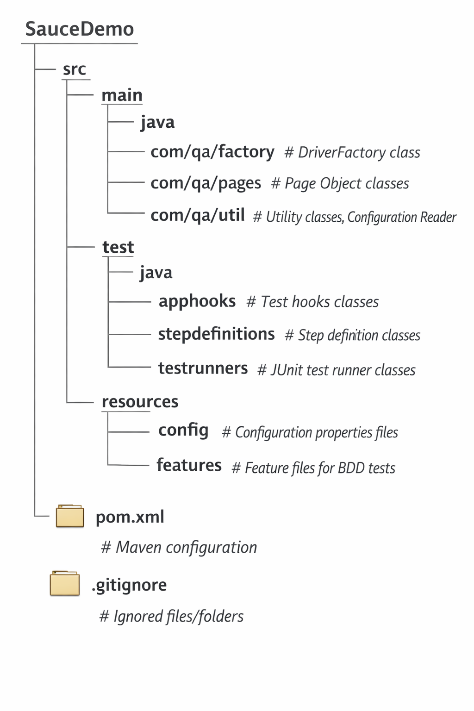

# SauceDemo

This project uses Selenium WebDriver with Java, Maven, and Cucumber to implement automated tests for the [SauceDemo](https://www.saucedemo.com) web application.

---

## Project Structure



---

## Technologies Used

- **Java 11+**  
- **Selenium WebDriver**  
- **Cucumber** (for BDD test scenarios)  
- **Maven** (for build and dependency management)  
- **JUnit** (for test execution)  
- **Git & GitHub** (version control) 

---

## How to Run

1. **Clone the repository**  
```bash
    git clone https://github.com/renishpadariya/saucedemo.git

2. **Import the project into Eclipse**
   - Go to File → Import → Maven → Existing Maven Project
   - Select the project root folder
    
3. **Install dependencies**
   - Maven will automatically download required dependencies from pom.xml

4. **Run tests**

   - **From Eclipse:** Right-click on your test runner classes → Run As → JUnit Test


